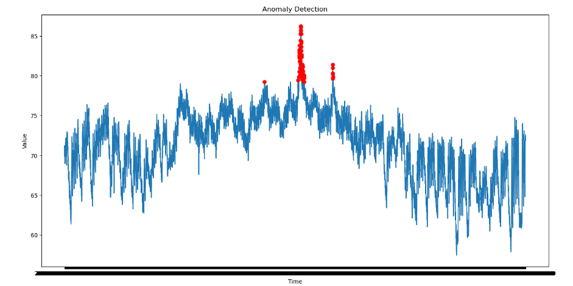

# Anomaly Detection using Autoencoder in TensorFlow

## Overview
This project focuses on **anomaly detection** using an autoencoder neural network built with TensorFlow. The system is designed to monitor **ambient temperature** data collected over time, and detect **system failures** by identifying deviations from expected behavior. This approach can be applied in various contexts, such as **predictive maintenance**, **fraud detection**, and **sensor monitoring**.

Anomalies, in this case, represent rare but significant deviations from normal temperature readings, potentially indicating a malfunction or failure in the system being monitored.

## Key Concepts

### Autoencoder
An autoencoder is a type of neural network used for unsupervised learning. It consists of two main components:
- **Encoder**: Reduces the input data to a compressed (latent) representation.
- **Decoder**: Reconstructs the original input data from the compressed form.

Autoencoders are well-suited for anomaly detection because they are trained to replicate normal behavior (data points without anomalies). Anomalies are identified as data points with high reconstruction errors, i.e., the model fails to accurately reproduce these points since they are outside the normal distribution.

### Anomaly Detection
Anomaly detection is the process of identifying rare events or patterns in data that do not conform to the expected behavior. In this project, anomalies represent temperature readings that differ significantly from normal behavior, which may indicate a system failure.

## Dataset
The dataset `ambient_temperature_system_failure.csv` contains temperature readings from a sensor monitoring an industrial system. The dataset includes:
- **timestamp**: The exact time the reading was taken.
- **value**: The temperature sensor reading at that time.

For this project, we focus solely on the `value` column, ignoring the timestamp during model training. The dataset includes normal readings, as well as data from periods where system failures occurred, making it ideal for testing anomaly detection methods.

## Project Workflow

### 1. Data Preprocessing
- Loaded the data using pandas and removed any rows with missing values.
- Converted the `value` column to the `float32` data type for optimal memory usage.
- Normalized the data to ensure that the autoencoder performs well by avoiding skew due to outliers or scale differences.

### 2. Model Architecture
- **Encoder**: The encoder part of the autoencoder compresses the input (temperature readings) into a lower-dimensional representation (10 features).
  - **Dense layer 1**: 32 units, activation `ReLU`
  - **Dense layer 2**: 16 units, activation `ReLU`
  - **Bottleneck**: 10 units (compressed representation)
  
- **Decoder**: The decoder reconstructs the data back to its original dimension.
  - **Dense layer 1**: 16 units, activation `ReLU`
  - **Dense layer 2**: 32 units, activation `ReLU`
  - **Output layer**: 1 unit (reconstructed temperature reading)

The model was compiled with the **Adam optimizer** and the **Mean Squared Error (MSE)** loss function, which measures the reconstruction error.

### 3. Model Training
- The model was trained for **50 epochs** using a **batch size of 32**.
- During training, the model learns to replicate the input data as closely as possible by minimizing the reconstruction error on the training set (which predominantly contains normal data).
- After training, the autoencoder becomes adept at reconstructing normal data, while struggling to reproduce anomalous data (i.e., system failures).

### 4. Anomaly Detection
- The reconstruction error (difference between the original input and the autoencoder's reconstruction) is used as the key metric for anomaly detection.
- A **threshold** for the reconstruction error is determined by taking the **99th percentile** of the errors on the training set, meaning that only the top 1% of highest errors are considered anomalies.
- All data points with reconstruction errors above this threshold are flagged as **anomalies**.

### 5. Model Evaluation
The model was evaluated using metrics commonly used in anomaly detection:
- **Precision**: Measures how many of the flagged anomalies were actually correct.
- **Recall**: Measures how many actual anomalies were correctly identified.
- **F1 Score**: The harmonic mean of precision and recall.

The model achieved **Precision = 1.0**, **Recall = 1.0**, and **F1 Score = 1.0**, indicating perfect performance on the dataset.

## Results
After running the model, the detected anomalies were identified with a high degree of accuracy. Anomalies correspond to periods where the temperature deviated significantly from normal values, suggesting system failures. Below is a visualization of the results:

### Anomaly Visualization
The graph below illustrates the temperature readings over time, with **anomalies marked in red**:


### Metrics:
- **Precision**: 1.0
- **Recall**: 1.0
- **F1 Score**: 1.0

These scores indicate the model's ability to detect anomalies with both high precision and high recall, meaning that it correctly identified all anomalies without raising false positives.

## Installation
To replicate this project, make sure you have the following dependencies installed:

```bash
pip install pandas tensorflow scikit-learn matplotlib keras
